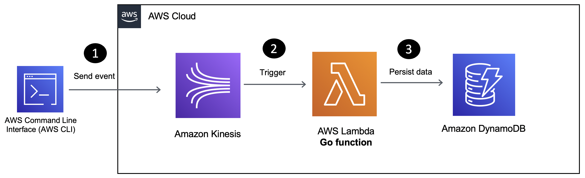

# Use Golang for data processing with Amazon Kinesis and AWS Lambda

This is for folks interested in learning how to use [Golang](https://go.dev/) and AWS Lambda to build a serverless solution. You will be using the [aws-lambda-go](https://github.com/aws/aws-lambda-go) library along with the [AWS Go SDK v2](https://github.com/aws/aws-sdk-go-v2) for an application that will process records from an Amazon Kinesis data stream and store them in a [DynamoDB](https://docs.aws.amazon.com/dynamodb/index.html) table. But that's not all! You will also use [Go bindings for AWS CDK](https://docs.aws.amazon.com/cdk/v2/guide/work-with-cdk-go.html) to implement "Infrastructure-as-code" for the entire solution and deploy it with the AWS CDK CLI.